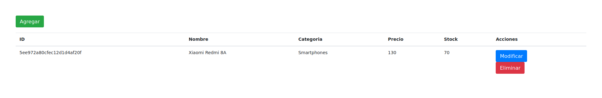
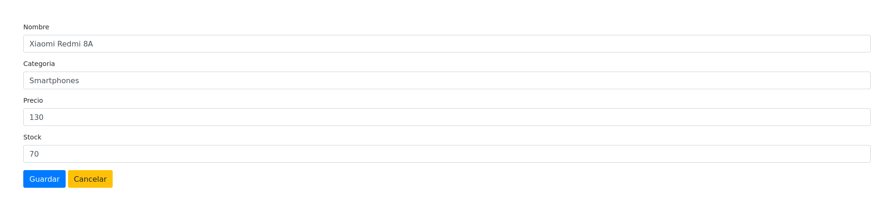

# EJS - C.R.U.D

C.R.U.D simple hecho con Express y EJS. 

## Inicializar el proyecto:

* Crea el proyecto con el motor de views

    `express [nombre_proyecto] --ejs`

* Ejecutar dentro del directorio del proyecto para instalar dependencias

    `npm install`

## Para iniciar el servidor:

* Inicia el servidor

    `npm start`

* Inicia el servidor y escucha los cambios en los archivos del codigo fuente
    
    `nodemon`

## Capturas

    

    

    

